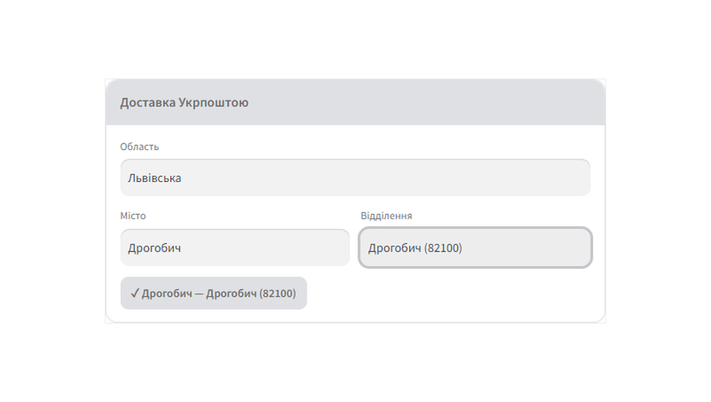
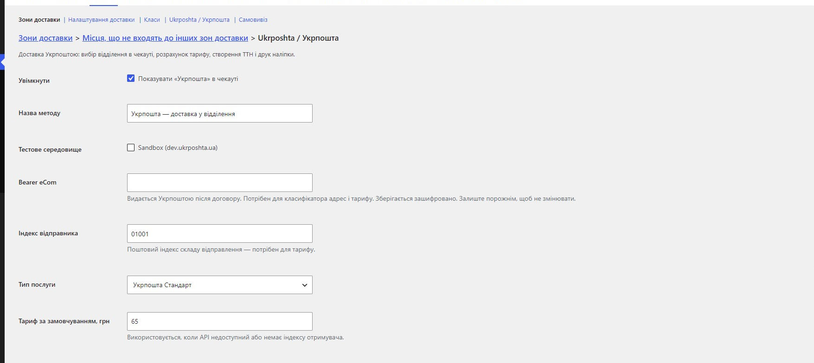

# Ukrposhta Shipping for WooCommerce

Ukrposhta (Укрпошта) shipping for **WooCommerce** — an in-checkout post-office picker backed by the official Ukrposhta Address Classifier, plus live domestic tariff calculation.

> **Scope of this release (1.0.0):** checkout picker + tariff. Shipment (barcode/ТТН) creation, sticker printing and cash-on-delivery are on the roadmap for a later update once verified end-to-end against a live contract.

## Features

- **Checkout picker** — customer chooses **region → city → post office**, powered by the official Ukrposhta Address Classifier. The selected post index is saved to the order.
- **Live tariff** — domestic delivery price from the Ukrposhta eCom API (`/domestic/delivery-price`); a configurable flat rate is the fallback, with optional free shipping over a threshold.
- **Shipping-zone method** — configured like any WooCommerce shipping method; credentials are store-global.
- **Encrypted credentials** — the eCom Bearer is stored obfuscated at rest.
- **HPOS-compatible**, translation-ready (`ukrposhta-shipping-for-woocommerce` text domain).

## Requirements

- WordPress 6.2+, WooCommerce 7.0+
- PHP 7.4+
- A Ukrposhta **eCom contract** — the Address Classifier and tariff authorise with an eCom **Bearer** issued by Ukrposhta after signing the contract.

## Installation

1. Upload the plugin to `/wp-content/plugins/` and activate it.
2. **WooCommerce → Settings → Shipping** — add the **Ukrposhta** method to a shipping zone.
3. Enter your eCom **Bearer** and sender postcode. Save and enable.
4. The post-office picker appears on the (classic) checkout.

> The picker targets the **classic** checkout. Order meta is also captured on the Store API (block) checkout path; a native block integration is planned.

## Screenshots

**Checkout — post-office picker (region → city → office)**

**Admin — shipping method settings**

## Licence

GPL-2.0-or-later.

## 🔗 CatCode

Модуль розробляє і підтримує студія **[CatCode](https://catcode.com.ua)**.

- 📄 Сторінка модуля з документацією та ліцензією: **https://catcode.com.ua/modules/ukrposhta-%d0%b2%d0%b8%d0%b1%d1%96%d1%80-%d0%b2%d1%96%d0%b4%d0%b4%d1%96%d0%bb%d0%b5%d0%bd%d0%bd%d1%8f-%d1%82%d0%b0%d1%80%d0%b8%d1%84-%d0%b4%d0%bb%d1%8f-woocommerce/**
- 🧩 Усі наші модулі для OpenCart та WooCommerce: https://catcode.com.ua/modules/
- ✉️ Підтримка: catcode.info@gmail.com
